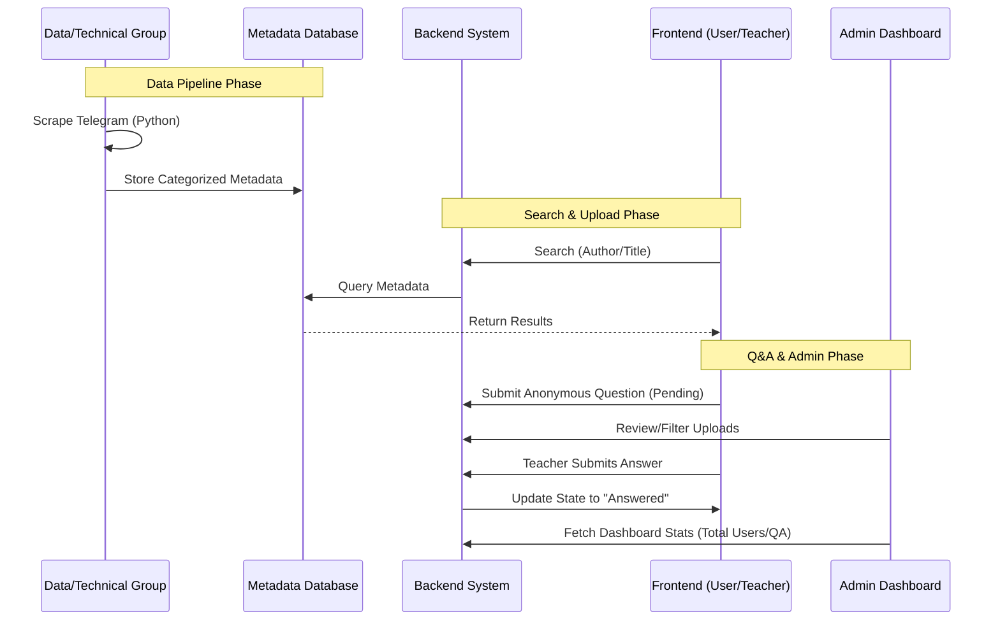

```mermaid
sequenceDiagram
    participant TA as Data/Technical Group
    participant DB as Metadata Database
    participant BE as Backend System
    participant FE as Frontend (User/Teacher)
    participant AD as Admin Dashboard

    Note over TA, DB: Data Pipeline Phase
    TA->>TA: Scrape Telegram (Python)
    TA->>DB: Store Categorized Metadata

    Note over FE, BE: Search & Upload Phase
    FE->>BE: Search (Author/Title)
    BE->>DB: Query Metadata
    DB-->>FE: Return Results

    Note over FE, AD: Q&A & Admin Phase
    FE->>BE: Submit Anonymous Question (Pending)
    AD->>BE: Review/Filter Uploads
    FE->>BE: Teacher Submits Answer
    BE->>FE: Update State to "Answered"
    AD->>BE: Fetch Dashboard Stats (Total Users/QA)
```
